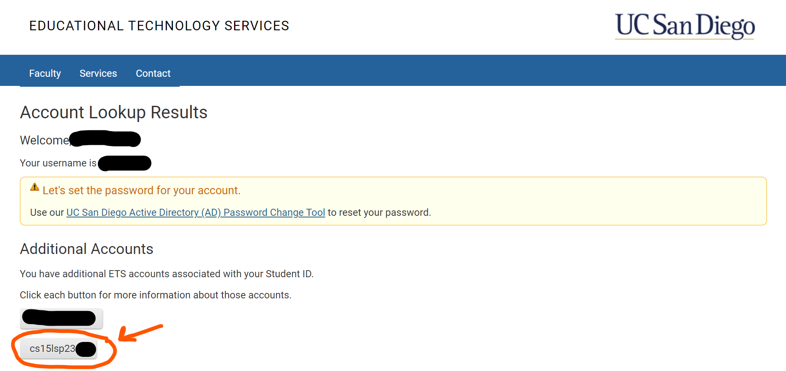
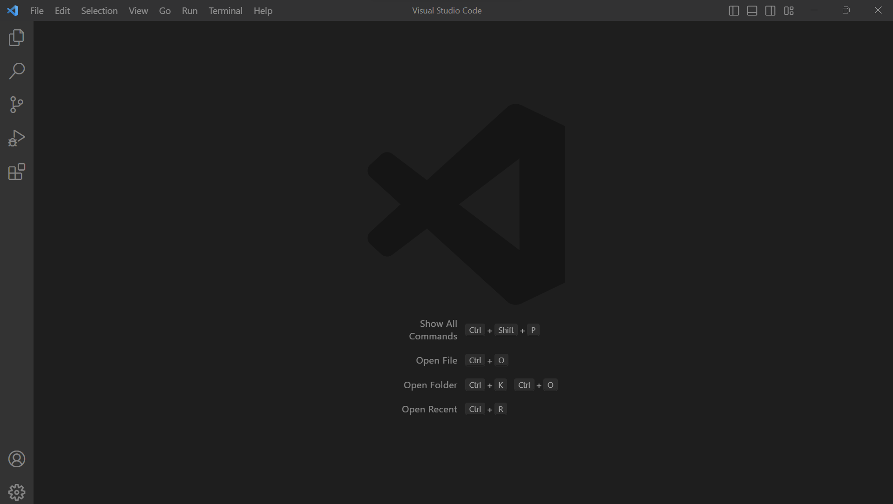
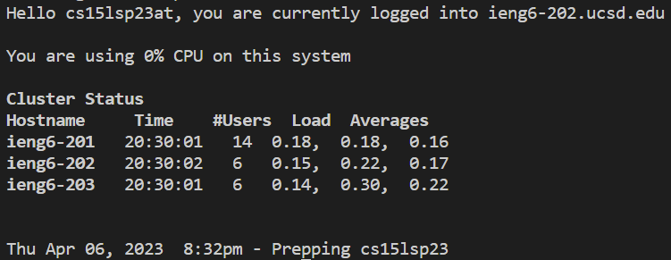
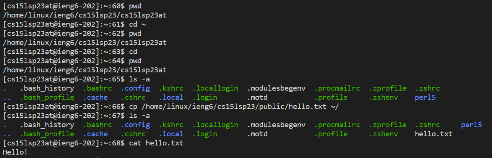

# Lab Report 1 - Remote Access and FileSystem (Week 1)
This lab report establishes a detailed screenshot tutorial for logging into a CSE 15L course-specific account on `ieng6` through the following steps:
* [Finding Your CSE 15L Account](https://k3liang.github.io/cse15l-lab-reports/lab1.html#step-0-finding-your-cse-15l-account)
* [Installing Visual Studio Code](https://k3liang.github.io/cse15l-lab-reports/lab1.html#step-1-installing-visual-studio-code)
* [Remotely Connecting](https://k3liang.github.io/cse15l-lab-reports/lab1.html#step-2-remotely-connecting)
* [Trying Some Commands](https://k3liang.github.io/cse15l-lab-reports/lab1.html#step-3-trying-some-commands)

## Step 0: Finding Your CSE 15L Account
Of course, if you already have your CSE 15L account username and password set up, then you can skip to the [next step](https://k3liang.github.io/cse15l-lab-reports/lab1.html#step-1-installing-visual-studio-code)!

If not, then you can find your course-specific account at <https://sdacs.ucsd.edu/~icc/index.php>. Enter in your username and PID and you should see a page that shows your CSE 15L account:

* You should see your CSE 15L account username, which should start with `cs15l`. Copy that/Memorize for later use.
* We now need to reset your account password. Click on the button for your CSE 15L account
* Click on the hyperlink that says **Global Password Change Tool** and follow the onscreen instructions to reset your password.
* You should end on a message that says something like "Password change successful."
With that out of the way, we can move on to setting up our terminal!
## Step 1: Installing Visual Studio Code
Now the very first thing you need to do is download VScode at <https://code.visualstudio.com/> and follow the onscreen instructions if you don't already have VScode installed.
The opening screen should look something like this (maybe with different colors/themes):

I already had VScode installed from a prior class, so I didn't have to go through this beginning step.

Unfortunately, if you're on Windows like I am, you will also need to install `git` for Windows through <https://gitforwindows.org/>, following the onscreen instructions.  
After that, you can set the default VScode terminal to the newly installed `git bash` by following the steps in this post:  
[Setting Git Bash as Default Terminal For Windows](https://stackoverflow.com/questions/42606837/how-do-i-use-bash-on-windows-from-the-visual-studio-code-integrated-terminal/50527994#50527994)

We are now ready to ssh :)
## Step 2: Remotely Connecting
* If your VScode terminal isn't already open, you can open it through Ctrl or Command + ` like I did, or you can also click the Terminal option on the top menu bar, and then click on New Terminal
* Now type in the command `ssh` followed by your course-specific account username and hit enter
    * It will look like `ssh cs15lyyyyzz@ieng6.ucsd.edu` with the `yyyyzz` part being different
* If it's your first time you're connecting to the server, you'll get a message that asks yes/no; go ahead and type `yes` and hit enter
* Then type/paste in your password you set from before and hit enter
Your output will look something like this:

Now, any commands you run on the terminal will run on the remote server rather than your own computer. You can try some commands out; in the next step, I'll show some examples of commands I tried.
## Step 3: Trying Some Commands
This step is a little bit of freedom, where you can try out whatever commands you want and see what happens.  
Here's a screenshot of some of the commands I tried and their output

I just used some basic commands (`pwd` `cd` `ls` `cp` `cat`) and I'll try explaining them below:
* `pwd`: An abbreviation for "print working directory" and it does just that; it's an easy way to check my current directory, which in my case was `/home/linux/ieng6/cs15lsp23/cs15lsp23at`
* `cd`: An abbreviation for "change directory" and it does just that based on the path that comes after it
    * The `~` symbol stands for the home directory; and by using `cd ~` and `pwd`, I'm able to see that I was already at my home directory from the beginning, which makes sense
    * By using `cd` and `pwd` in succession, I'm able to confirm that `cd` without arguments just takes me to my home directory
* `ls`: prints a list of the files and directories in the current directory
    * The `-a` afterwards just means that `ls` includes entries starting with `.`
        * You can find out more info about commands like this directly through typing `--help` afterwards such as `ls --help`
* `cp`: copies a file to a given path
    * `cp /home/linux/ieng6/cs15lsp23/public/hello.txt ~/` copied the public `hello.txt` file to my home directory, which was confirmed through `ls -a`
* `cat`: prints out the contents of a given file
    * `cat hello.txt` printed out the contents of the `hello.txt` file that was now in my home directory
* One final note: if you want to log out of the remote server, you can use either Ctrl-D or run the command `exit`

That's pretty much it for this tutorial on remote access! Hope you got something out of this :D
