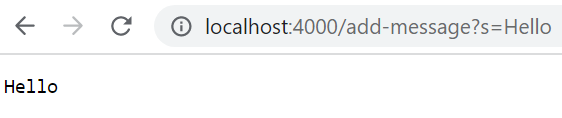
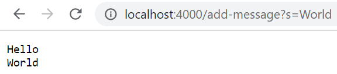
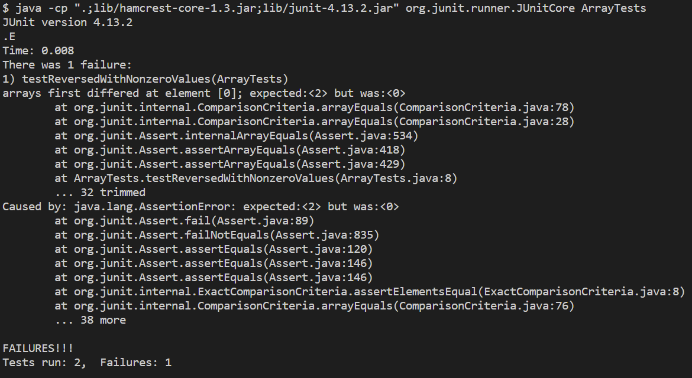
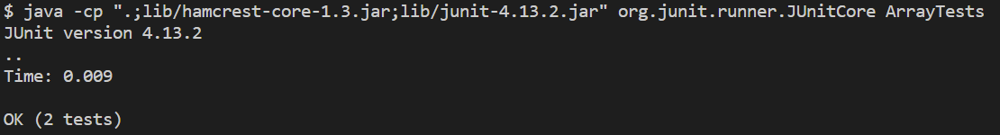

# Lab Report 2 - Servers and Bugs (Week 3)
* [Part 1](https://k3liang.github.io/cse15l-lab-reports/lab2.html#part-1)
* [Part 2](https://k3liang.github.io/cse15l-lab-reports/lab2.html#part-2)
* [Part 3](https://k3liang.github.io/cse15l-lab-reports/lab2.html#part-3)

## Part 1
Here's my implementation of the `StringServer` web server that keeps track of a single string that is added to by requests.

```
import java.io.IOException;
import java.net.URI;

class StringHandler implements URLHandler {
    String webString = "";
    public String handleRequest(URI url) {
        if (url.getPath().equals("/add-message")) {
            String[] params = url.getQuery().split("=");
            if (params[0].equals("s")) {
                webString += params[1] + "\n";
                return webString;
            }
        } 
        return "404 Not Found!";
    }
}

class StringServer {
    public static void main(String[] args) throws IOException {
        Server.start(4000, new StringHandler());
    }
}
```

Here are two examples of using `/add-message`




For the first screenshot:
* The `handleRequest` method of the `StringHandler` class is called when the URL is entered by the user
* The argument passed to this method is the entered URL, and the Java value of this argument would be something equivalent to  
`new URI("http://localhost:4000/add-message?s=Hello")` (Java's library uses `URI` but for our purposes, we will treat it as a normal URL), and this URL contains two important components for `handleRequest`:
    * `url.getPath()` is the path of the URL, which in this case is `"/add-message"`
    * `url.getQuery()` is the query of the URL, which in this case is `"s=Hello"` (Java excludes the `?` symbol of the query)
* The relevant field of `StringHandler` that holds the entire string is called `webString`, and before the request, it was simply the empty string, `""`
* For `/add-message` requests, the value of `webString` changes to concatenate the user-passed query string, as well as the new-line literal to keep all the requests on different lines. Thus, for this specific request, `webString` changes to `"Hello\n"`

For the second screenshot, the same logic applies as for the first screenshot:
* The `handleRequest` method of the `StringHandler` class is called when the URL is entered by the user
* The argument passed is the URL, equivalent to `new URI(http://localhost:4000/add-message?s=World)`
    * `url.getPath()` would be `"/add-message"`
    * `url.getQuery()` would be `"s=World"`
* `webString` would initially be `Hello\n`
* After the method is finished and the request is handled, `webString` is changed to `Hello\nWorld\n`

## Part 2
As a reminder if you don't have the code, the buggy `reversed` method of the `ArrayExamples` class was as follows:

```
static int[] reversed(int[] arr) {
  int[] newArray = new int[arr.length];
  for(int i = 0; i < arr.length; i += 1) {
    arr[i] = newArray[arr.length - i - 1];
  }
  return arr;
}
```

* A failure-inducing input to this program would be any integer array that contains an element other than `0`, which is the default value for integer arrays. As a JUnit test, this looks like:

```
@Test
public void testReversedWithNonzeroValues() {
  int[] input = {1, 2};
  assertArrayEquals(new int[]{2, 1}, ArrayExamples.reversed(input));
}
```

* On the other hand, if you were to input an empty array or an array with only the default values (only `0`), then no failure would be induced, such as the following JUnit test:

```
@Test
public void testReversedWithDefaultValues() {
    int[] input = {0, 0};
    assertArrayEquals(new int[]{0, 0}, ArrayExamples.reversed(input));
}
```

And here's the symptom (the output of running the JUnit tests):


* As expected, no failure occurred for `testReversedWithDefaultValues`, which was our non-failure-inducing input. And as expected, a failure did occur for our failure-inducing input, `testReversedWithNonzeroValues`.
* JUnit helpfully tells us that for the failure-inducing input `{1, 2}`, the first element of the reversed array was expected to be `2`; however, the actual output from the `reversed` method was the default integer array value of `0`

I also went ahead and fixed the `reversed` method, and here's the before-and-after of the change.

Before:

```
static int[] reversed(int[] arr) {
  int[] newArray = new int[arr.length];
  for(int i = 0; i < arr.length; i += 1) {
    arr[i] = newArray[arr.length - i - 1];
  }
  return arr;
}
```

After:

```
static int[] reversed(int[] arr) {
  int[] newArray = new int[arr.length];
  for(int i = 0; i < arr.length; i += 1) {
    newArray[i] = arr[arr.length - i - 1];
  }
  return newArray;
}
```

To see why this fix actually addresses the issue, here's a line of reasoning that you can take:
* It can be seen from the initial line `int[] newArray = new int[arr.length]` that the author of the program was hoping for `newArray` to be a reversed copy of the argument `arr`
* Thus, the for loop *should* pass in elements of `arr` into `newArray` in reversed order; however, a bug is definitely apparent here, where `newArray` and `arr` are in the opposite places of where they should be in the line of assignment: (Before) `arr[...] = newArray[...]`
    * This results in `arr` being filled in by the elements of `newArray` in reversed order! In Java, `newArray` would be initialized with `0`s, and so then `arr` would just be filled in with `0`s and `newArray` wouldn't be changed!
    * Thus the fix here is just to switch `newArray` and `arr` on that particular line of array assignment, making it `newArray[...] = arr[...]`
* There's one last issue of the `reversed` method. After the for loop, we need to return the reversed copy of `arr` (i.e. return `newArray`), but the initial code instead just returned the argument array `arr` 
    * This is an easy fix; just change `return arr;` to `return newArray;`

And the bug is fixed! This can easily be verified by recompiling and running JUnit again:



## Part 3
I learned a lot from the week 2 lab, since I previously didn't really understand how web servers worked. Through the process, I first learned about the fact that these web servers take up ports on a computer, and thus two different servers on the same computer require different ports. The ports are part of the domain, but we usually don't see them in URLs because there are default ports that are used, and the browser doesn't need to show that extraneous information usually. I also learned that servers don't have to be running on my local computer all the time; I can leave that task up to the remote computers! Doing that also allows me to easily send requests to the web server from other computers. Finally, I learned about the fact that a web server has to have a backend implementation that handles URL requests and returns output as web pages to the user. Then by writing the "SearchEngine" class, I got hands-on experience on how to process the URL in order to keep track of a list of strings, which was a pretty simple case and it wasn't necessarily a styled web page, but it ultimately helped me comprehend the web server process of handling URL requests.
