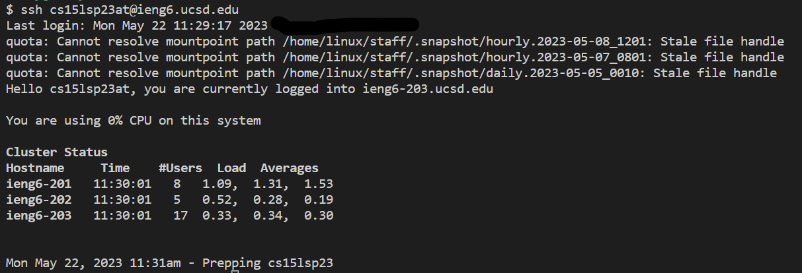
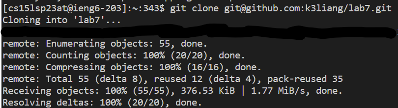

# Lab Report 4 - Command Line Tasks (Week 7)

## Step 4
**TASK:** *Log into ieng6*

  
Keys pressed: `ssh cs15lsp23at@ieng6.ucsd.edu<enter>`
- For this step, I just typed out the full `ssh` command with my username, `ssh cs15lsp23at@ieng6.ucsd.edu`, which is the command for logging into a server like `ieng6`.
- At the time, the `ssh` command wasn't in the history of my VS code terminal, but if it was, then I also could have kept typing `<up>` to get to the command, or I could've done a search for my command through `<Ctrl-R>`.
- It can also be noted that I didn't have to enter in my password here because I already generated an `SSH` key for `ieng6`, during lab on week 7. This saves a lot of time!

## Step 5
**Task:** *Clone your fork of the repository from your Github account*

  
Keys pressed: `git clone <Ctrl-V><enter>`
- I fully typed out `git clone`. However, for the `SSH` clone URL, I just copied it from Github (`<Ctrl-C>` can be used, or you can use the clipboard button) and then I pasted it into the terminal by pressing `<Ctrl-V>`
- The `git clone` command is how you use the command line to clone repositories from Github.
- I also was able to use the `SSH` clone URL because I had set up a `SSH` authentication key for Github in lab of week 7.

## Step 6
**Task:** *Run the tests, demonstrating that they fail*

  
Keys pressed: `cd l<tab><enter>`, `bash t<tab><enter>`
- I first had to change my current working directory to the newly created `lab7` folder, which involved typing the `cd` command. To type out the directory name, I simply just had to type one letter to get an unambiguous match, and then `<tab>` autofilled to that name match
- Furthermore, instead of having to write `javac -cp .:lib/hamcrest-core-1.3.jar:lib/junit-4.13.2.jar *.java` and `java -cp .:lib/hamcrest-core-1.3.jar:lib/junit-4.13.2.jar org.junit.runner.JUnitCore ListExamplesTests`, I saw that the repository had a bash script for setting up and running the tests. I just had to run the script by typing out `bash` and then inputting the script name. There is only one file in `lab7` that starts with a `t` so I only had to type that to get an unambiguous match to which I could `<tab>` and autocomplete.

## Step 7
**Task:** *Edit the code file to fix the failing test*

Entering Vim:  
  
Editing in Vim:  
  
Keys pressed: `vim L<tab>.j<tab><enter>`, `/index1<enter>nnnnnnnnn>>>>>>i<backspace>2<escape>:wq<enter>`
- To edit the `ListExamples.java`file, I first had to enter in the `vim` command. By typing in `L` and then hitting `<tab>`, I got an autocomplete of up to `ListExamples`, because all the files in the repository that started with `L` also began with `ListExamples`. Then by matching to `.java` with just `.j` I can autocomplete with `<tab>`
- In vim, I did a search for the mistake of `index1` with the `/` search command. Because the mistake was 9 `index1` matches away from the beginning, I had to press `n` that many times.
- Insert mode was entered with `i` and then I made the edit from `1` to `2`. `<escape>` quit insert mode.
- Saving and quitting in vim is `:wq` in normal mode

## Step 8
**Task:** *Run the tests, demonstrating that they now succeed*

  
Keys pressed: `bash t<tab><enter>`
- This is a repeat of step 6, as I can rerun the tests through running the `test.sh` bash script. 
- `t` only has one match, which is `test.sh`, and so I can autocomplete with `<tab>`

## Step 9
**Task:** *Commit and push the resulting change to your Github account*

  
Keys pressed: `git add L<tab>.j<tab>`, `git commit -m "fixed ListExamples.java"`, `git remote add origin <Ctrl-V>`, `git push origin main`
- First, I have to stage the `ListExamples.java` file for a commit, by typing `git add`, and then I inputted the file name the same way I did previously, with `L` to `<tab>` to `ListExamples` and then a `.j` to `<tab>` to `.java`.
- After adding, I have to make a commit with `git commit`, and normally it would take me to vim where I can type out a commit message. But I just did `-m` which lets me type out my commit message on the command line.
- Then I can assign my `SSH` URL, `git@github.com:k3liang/lab7.git` to `origin` through `git remote add` and then pasting in the URL with `<Ctrl-V>`. But apparently, `origin` was already pre-designated with the `SSH` URL, but it's never a bad idea to make sure.
- Finally pushing to the Github repository involves the `git push` command, where I push my commits to the `main` branch on `origin`, where my Github repository is.
