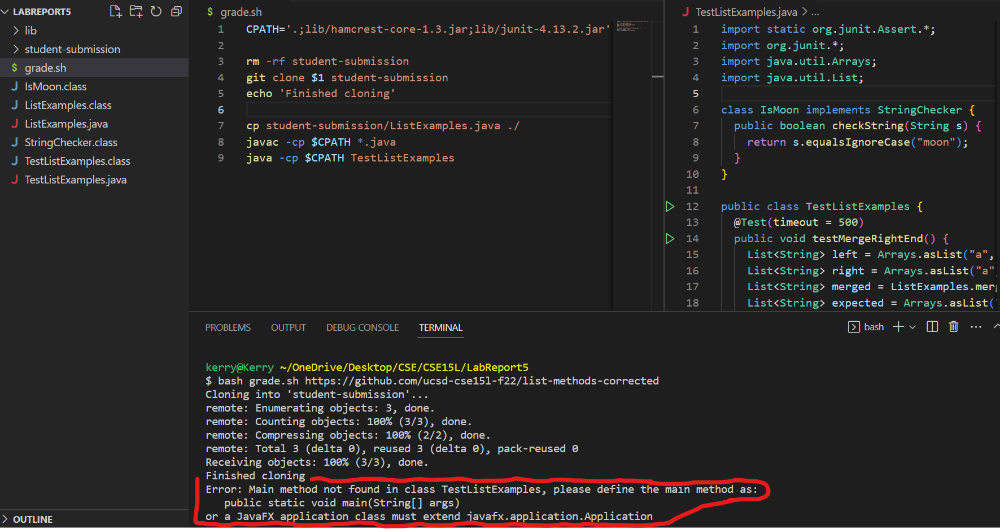
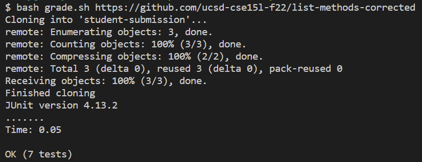

# Lab Report 5 - Debugging Scenario & Reflection (Week 9)

## Part 1 - Debugging Scenario / Edstem Post
***Student:***

**What environment are you using (computer, operating system, web browser, terminal/editor, and so on)?**

I'm on a Windows operating system, editing the code on Visual Studio Code, and using the terminal on Visual Studio Code.

**Detail the symptom you're seeing. Be specific; include both what you're seeing and what you expected to see instead. Screenshots are great, copy-pasted terminal output is also great. Avoid saying “it doesn't work”.**


I'm testing out my grade script; however, I ran into this error displayed in the terminal (the symptom):  
```
Error: Main method not found in class TestListExamples, please define the main method as:  
   public static void main(String[] args)
or a JavaFX application class must extend javafx.application.Application
```
I originally expected for there to be an output message saying that the tests ran and passed; however, instead, I got an error about the fact that a main method was not found in my tester file.

**Detail the failure-inducing input and context. That might mean any or all of the command you're running, a test case, command-line arguments, working directory, even the last few commands you ran. Do your best to provide as much context as you can.**

To induce the failure, the command I typed was `bash grade.sh https://github.com/ucsd-cse15l-f22/list-methods-corrected`
However, the error occurs for the grading script no matter what repository URL I pass in, so I suspect that the grading script itself or the tester file has some bug in it which causes the symptom.
This would make sense, because any use of `bash grade.sh` is a failure-inducing input. Nothing is wrong with my working directory, since I'm on the working directory that has my
bash script and tester file. Additionally, the first time I ran the `bash grade.sh` command and caused the symptom, I had run no other additional commands other than running the script. 
Overall, I know something must be wrong with the bash script or the tester file, but I don't understand how the main method of Java correlates with the bug I'm facing. 
Does anyone know what's wrong?


***TA:***  
Take a look at your `grade.sh` file, line 9. The `java` command requires the passed-in file to have a main method as a starting point for execution.
However, you only passed in your tester file, `TestListExamples`, which wouldn't have the main method that `java` requires. I think you were already expecting
the JUnit library to provide that main method for you; however the `-cp` option doesn't explicitly provide that main method to Java. The JUnit file that 
has the main method which runs your tests is called `org.junit.runner.JUnitCore`, so try out the command `java -cp $CPATH org.junit.runner.JUnitCore TestListExamples` instead.

***Student:***

  
It worked, thank you! I got the expected message that the tests all ran and passed for the correct `ListExamples` implementation.  
I think I understand the bug now; I'm not used to typing the JUnit running commands out, so I left out the runner class in the `java` command
but the tester file has no main method to run itself. Thus, Java spits out an error message saying that it can't find a main method, when in reality, the tester file 
itself doesn't need a main method. JUnit provides a file with that runner method.


For people who want to know my setup that led to this bug, here's a breakdown:
For my working directory, the only things necessary are:
* the `lib` folder with the JUnit library files: `hamcrest-core-1.3.jar` and `junit-4.13.2.jar`
* the `TestListExamples` file which held all my JUnit tests for the grading of repositories
* the `grade.sh` bash script which handles all the work to get the repository URLs graded

The exact contents of the tester file `TestListExamples` is not exactly important to this particular bug, and it's too long to paste here, but as an overview, 
all it had were tester methods that checked the correctness of the repository's methods. 

For the `grade.sh` file, here is what it looked like before the bug was fixed:
```
CPATH='.;lib/hamcrest-core-1.3.jar;lib/junit-4.13.2.jar'

rm -rf student-submission
git clone $1 student-submission
echo 'Finished cloning'

cp student-submission/ListExamples.java ./
javac -cp $CPATH *.java
java -cp $CPATH org.junit.runner.JUnitCore TestListExamples
```

In order to trigger the bug, I just needed to use `bash grade.sh` on any repository URL.
In my case, I did `bash grade.sh https://github.com/ucsd-cse15l-f22/list-methods-corrected`

In order to fix the bug, all I did was change line 9 of the `grade.sh` file to be `java -cp $CPATH org.junit.runner.JUnitCore TestListExamples`

## Part 2 - Reflection
One of the most interesting and useful things I learned in lab was how to write bash scripts and use them to help automate tasks.
I thought it was super interesting that I could take a look into the backend of how autograders work to score my programming assignments, and it certainly wasn't
something that I was fully knowledgeable about beforehand. Making my own autograder script was also really new and fun,
and because of the practice done in lab with the autograder script, I was able to get more familiar with bash scripts, and now I can start using them with less hesitation
if I ever need them. 
